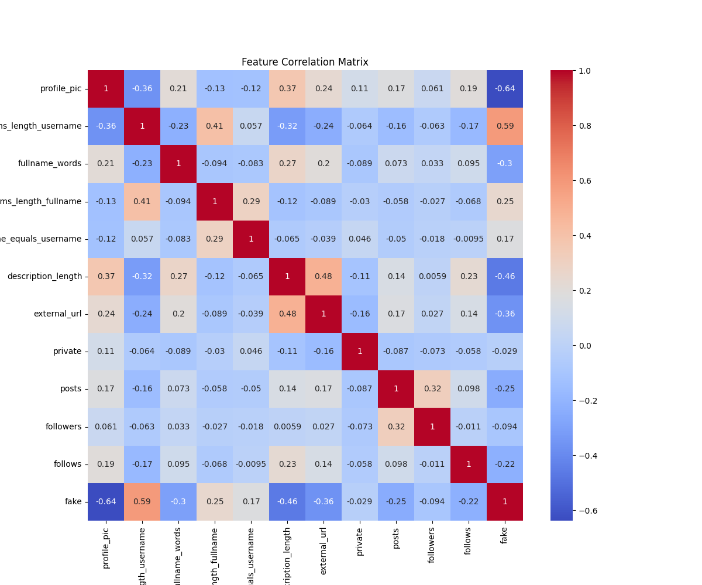
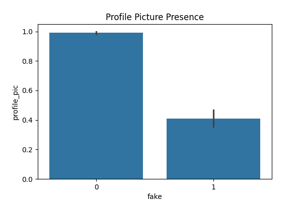
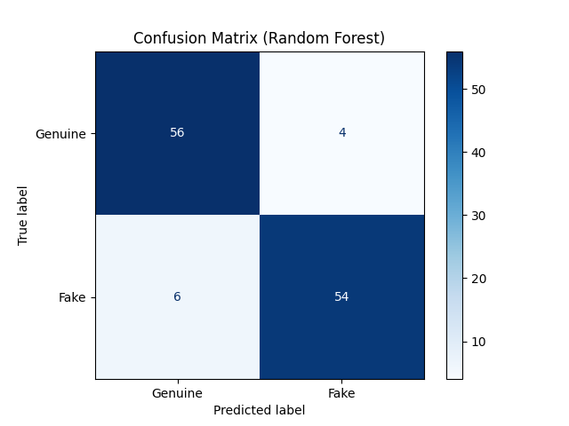

# 📸 Instagram Fake Account Detection

## 📌 Project Overview
This project uses **Machine Learning (Random Forest & Decision Tree)** to classify Instagram accounts as **Fake (Spammer)** or **Genuine**. By analyzing features like profile picture presence, follower counts, and username length, the model can automatically flag suspicious accounts with high accuracy.

## 📊 Key Visualizations

### 1. Feature Correlation Matrix
We analyzed which features correlate most with fake accounts.

### 2. Profile Picture Analysis
Fake accounts are significantly less likely to have a profile picture compared to genuine users.

### 3. Model Accuracy (Confusion Matrix)
The confusion matrix showing the model's correct vs. incorrect predictions.

### 4. Feature Importance
The top factors (like #followers and #posts) used by the AI to detect fakes.

## 🛠️ How to Run
1. Install dependencies: `pip install -r requirements.txt`
2. Run the analysis: `python main.py`