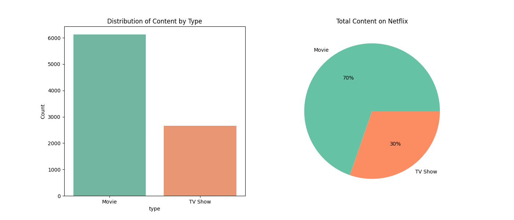
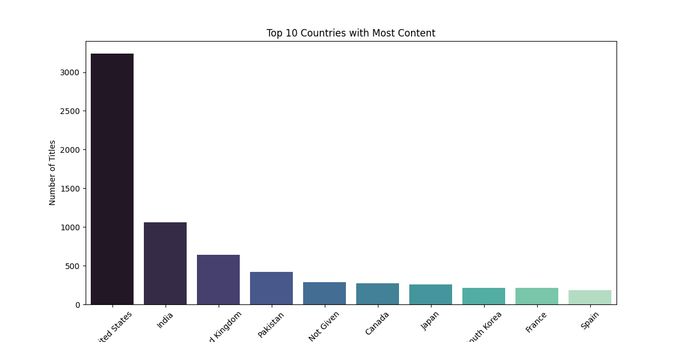
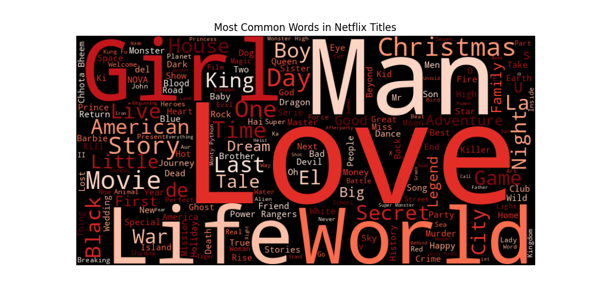

# 🎬 Netflix Content Strategy Analysis

## 📌 Project Overview
An Exploratory Data Analysis (EDA) of Netflix's library to uncover content strategies. We analyzed over 8,000 titles to understand the ratio of **Movies vs. TV Shows**, identified the top producing countries, and visualized the explosion of content in recent years.

## 📊 Key Visualizations

### 1. Content Distribution
The ratio of Movies to TV Shows on the platform.

### 2. Top Producing Countries
The top 10 countries contributing content to Netflix.

### 3. Yearly Content Growth
How Netflix aggressively ramped up content addition starting from 2016.

### 4. Title Word Cloud
The most common words found in Netflix titles.

## 🛠️ How to Run
1. Place `netflix_titles.csv` in `data/`.
2. Run the script: `python main.py`