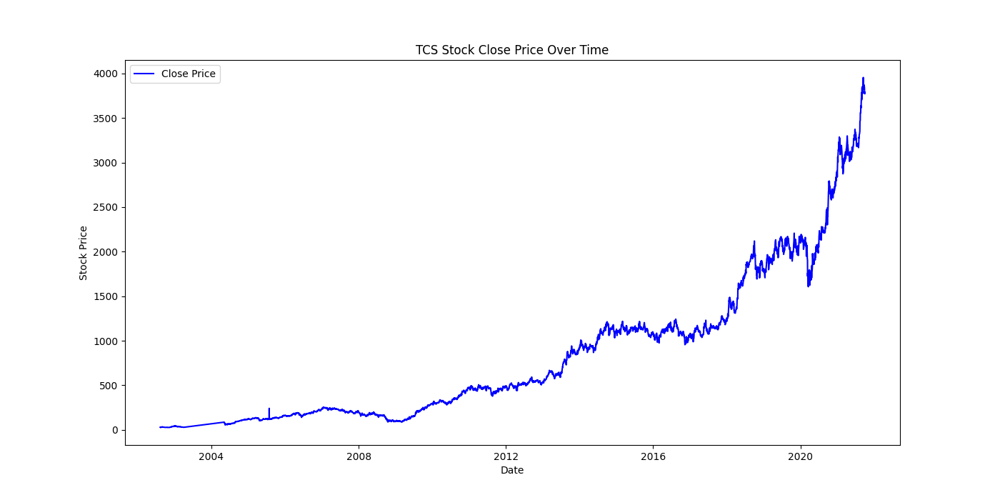
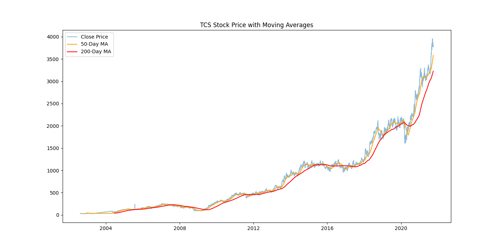
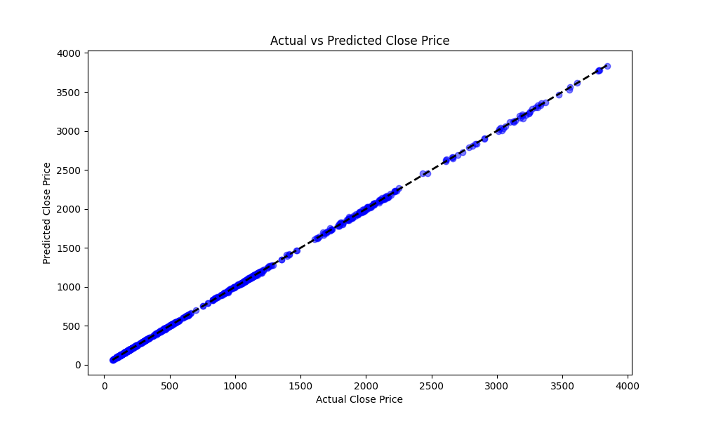

# 📈 TCS Stock Price Prediction

## 📌 Project Overview
This project analyzes the historical stock data of **Tata Consultancy Services (TCS)** to identify trends and predict future closing prices. Using **Linear Regression**, we built a model that explains price movements with high accuracy.

## 📊 Key Visualizations

### 1. Stock Price History
A view of TCS's massive growth over the last decade.

### 2. Moving Averages (Trend Analysis)
The 50-Day (Orange) and 200-Day (Red) Moving Averages used to identify trends.

### 3. Prediction Accuracy
The scatter plot of **Predicted vs. Actual** prices. The perfect diagonal line indicates high accuracy.

## 🛠️ How to Run
1. Place `TCS_stock_data.csv` in `data/`.
2. Run the script: `python main.py`