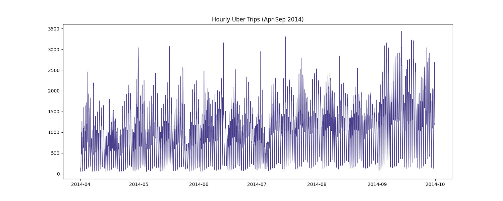
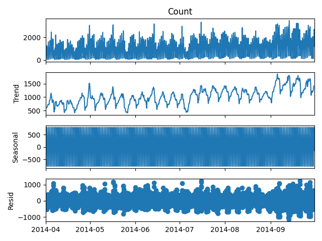
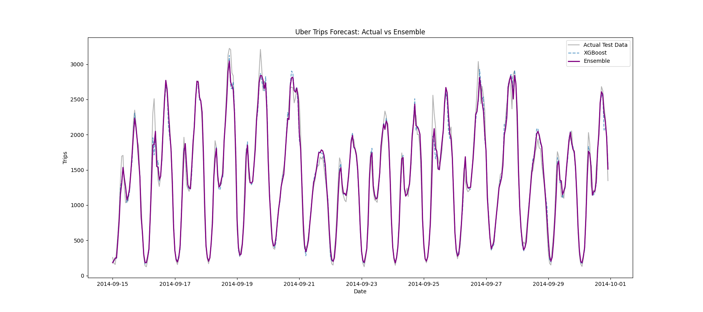

# 🚖 Uber Trip Analysis & Forecasting (NYC)

## 📌 Project Overview
This project analyzes **Uber pickup data in New York City (Apr-Sep 2014)** to understand ridership patterns and forecast future demand. We used **XGBoost** and **Random Forest** regressors to predict hourly trip volume.

## 📊 Key Visualizations

### 1. Hourly Trip Volume
Visualizing the raw demand shows clear daily peaks (rush hours) and a steady increase in usage.

### 2. Seasonal Decomposition
Breaking down the data into Trend, Seasonality, and Residuals.

### 3. Forecast vs Actual
Comparing our Ensemble Model's predictions (Purple) against the Actual demand (Gray).

## 🛠️ How to Run
1. Place the 2014 Uber CSV files in `data/`.
2. Run the script: `python main.py`